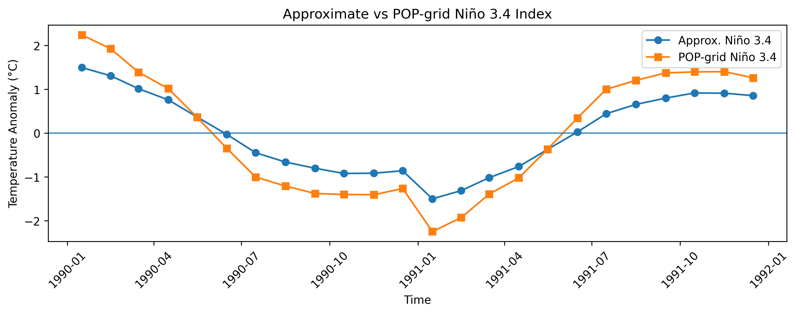

# ENSO Analysis Toolkit for CESM Ocean Data

A Python package for analyzing ENSO variability in CESM ocean model output, including computation of temperature anomalies and Niño 3.4 indices.

---

## Overview

This project provides a modular workflow for working with CESM ocean temperature data and extracting ENSO-related signals.

It includes:

- Surface temperature visualization  
- Monthly anomaly computation  
- Global mean anomaly time series  
- Approximate Niño 3.4 index (grid-based)  
- POP-grid Niño 3.4 index (latitude/longitude + area-weighted)  

The toolkit is designed to simplify working with large, cloud-hosted CESM datasets and provide a foundation for climate analysis workflows.

---

## Package Structure

```
enso_final_project/
├── enso_toolkit/
│   ├── core.py      # main analysis functions
│   ├── io.py        # data loading
│   ├── utils.py     # validation helpers
├── examples/
│   ├── quickstart.py
│   ├── exploration.ipynb   # exploratory analysis notebook
├── slides.qmd
├── README.md
└── pyproject.toml
```

---

## Installation

Clone the repository:

git clone https://github.com/Natuka1993/enso_final_project.git  
cd enso_final_project  

Create and activate a conda environment:

conda create -n cesm_phase1 python=3.11  
conda activate cesm_phase1  

Install the package:

pip install -e .  

Install dependencies:

pip install grab_cesm pop-tools matplotlib xarray pandas  

---

## Quick Start

Run the example script:

python examples/quickstart.py  

This will generate:

- surface_temp.png  
- global_anomaly.png  
- nino34.png  
- nino34_comparison.png  
- nino34_mask.png  

---

## Example Output

### Niño 3.4 Comparison



The POP-grid implementation produces stronger variability compared to the approximate grid-based method, demonstrating the importance of geographic masking and area weighting.

---

## Features

- Modular Python package structure  
- Works with CESM NetCDF ocean data  
- Monthly climatology and anomaly computation  
- Multiple ENSO index methods  
- POP-grid integration with latitude/longitude coordinates  
- Area-weighted averaging  

---

## Scientific Motivation

ENSO is the dominant mode of interannual climate variability. Accurately computing ENSO indices requires careful preprocessing of ocean temperature data and correct spatial averaging.

This project compares:

- Approximate grid-based methods  
- Physically consistent POP-grid methods  

and demonstrates how proper geographic masking improves ENSO diagnostics.

---

## Dependencies

- Python 3.11  
- xarray  
- numpy  
- matplotlib  
- pandas  
- pop-tools  
- grab_cesm  

---

## Contributing

This project was developed as part of ATOC 4815/5815. Contributions and suggestions are welcome.

---

## Author

Natalia Jorbenadze  
CU Boulder ATOC  

---

## License

MIT License

