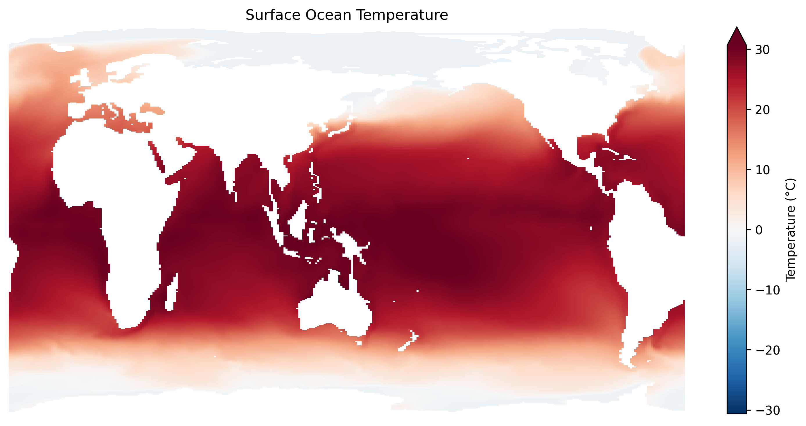
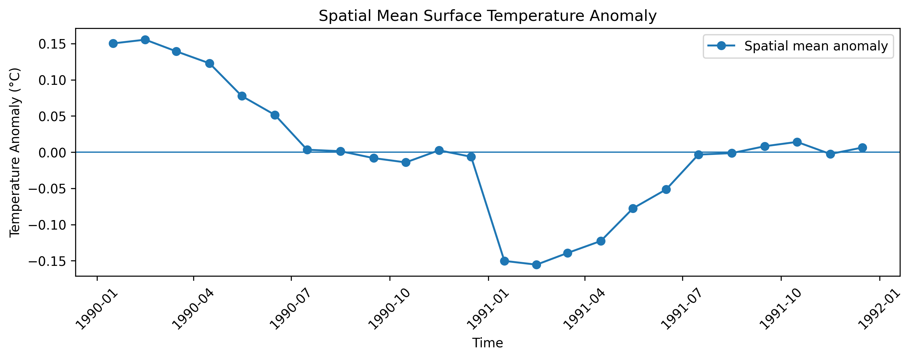
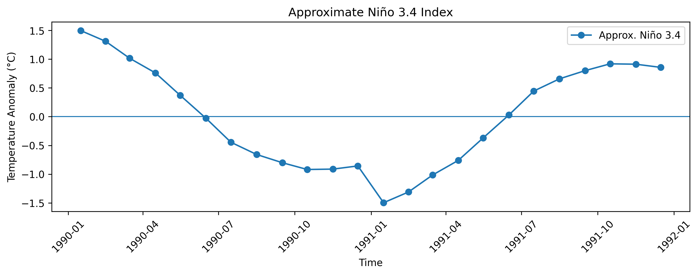

# Motivation

::: {.incremental}
- CESM ocean model output is powerful but difficult to work with directly
- Data are large, cloud-hosted, and not immediately analysis-ready
- This project builds a lightweight Python toolkit for ENSO-related ocean temperature diagnostics
:::

---

# Problem

How can we move from raw CESM ocean temperature output to interpretable climate diagnostics?

::: {.incremental}
- Surface ocean temperature
- Climatology
- Anomalies
- Variability time series
- Approximate Niño 3.4-style index
:::

---

# Package Goal

`enso_toolkit` simplifies a basic climate-analysis workflow:

```python
da = open_cesm_temp_surface()
global_anom = compute_global_mean_anomaly(da)
nino = compute_nino34_index(da)
```

::: {.incremental}
- Reduces repeated code
- Makes the workflow reusable
- Turns raw model output into climate diagnostics
:::

---

# Package Structure

```text
enso_final_project/
├── enso_toolkit/
│   ├── core.py      
│   ├── io.py        
│   ├── utils.py     
├── examples/
│   ├── quickstart.py
│   ├── exploration.ipynb   
├── slides.qmd
├── README.md
└── pyproject.toml
```

---

# Package Design

::: {.incremental}
- `io.py`: data access functions
- `utils.py`: validation and helper functions
- `core.py`: main analysis and plotting functions
- `quickstart.py`: example workflow showing how the package is used
:::

---

# Core Functions

::: {.incremental}
- `open_cesm_temp_surface()`
- `summarize_dataarray()`
- `plot_first_timestep()`
- `compute_spatial_mean()`
- `compute_monthly_climatology()`
- `compute_monthly_anomalies()`
- `compute_global_mean_anomaly()`
- `compute_variance()`
- `compute_nino34_index()`
:::

---

# Key Function: Data Access

```python
def open_cesm_temp_surface(time_slice=("1990-01", "1991-12"), member=0):
    da = open_cesm_temp(time_slice=time_slice, member=member)
    validate_dataarray(da, required_dims=["z_t", "time", "nlat", "nlon"])
    return da.isel(z_t=0)
```

::: {.incremental}
- Opens CESM ocean potential temperature
- Validates that expected dimensions are present
- Extracts the surface layer
- Returns an analysis-ready `xarray.DataArray`
:::

---

# Key Function: Input Validation

```python
def validate_dataarray(da, required_dims=None):
    if da is None:
        raise ValueError("Input data cannot be None.")

    if not hasattr(da, "dims"):
        raise TypeError("Input must be an xarray DataArray-like object.")

    if required_dims is not None:
        missing = [dim for dim in required_dims if dim not in da.dims]
        if missing:
            raise ValueError(f"Missing required dimensions: {missing}")
```

::: {.incremental}
- Adds basic error handling
- Prevents analysis from running on invalid inputs
- Makes the package safer and easier to debug
:::

---

# Key Function: Anomaly Time Series

```python
spatial_mean = compute_spatial_mean(da).load()
climatology = compute_monthly_climatology(spatial_mean)
global_anom = spatial_mean.groupby("time.month") - climatology
```

::: {.incremental}
- Computes spatial mean first for speed
- Removes the monthly climatology
- Produces a temperature anomaly time series
:::

---

# Key Function: Approximate Niño 3.4

```python
nino_region = da.isel(
    nlat=slice(150, 220),
    nlon=slice(180, 260),
)

nino_mean = compute_spatial_mean(nino_region).load()
climatology = compute_monthly_climatology(nino_mean)
nino_anom = nino_mean.groupby("time.month") - climatology
```

::: {.incremental}
- Approximates a Niño 3.4-style regional index
- Uses grid-index slicing as a prototype
- Future version will use exact lat/lon bounds on the CESM ocean grid
:::

---

## Surface Temperature

{width=90%}

::: {.incremental}
- Warm tropics, cold high latitudes → physically realistic
:::

---

## Spatial Mean Anomaly

{width=90%}

::: {.incremental}
- Seasonal cycle removed → highlights variability around zero
:::

---

## Approximate Niño 3.4 Index

{width=90%}

::: {.incremental}
- Focuses on ENSO region → stronger, more structured variability signal
:::

---

# Variability Metric

```python
variance = compute_variance(global_anom)
```

::: {.incremental}
- Spatial mean anomaly variance: `0.0075`
- Variance summarizes the strength of variability
- Useful for comparing longer runs, regions, or models later
:::

---

# Data Sources

::: {.incremental}
- CESM model output used in this project
- CAMulator datasets provided by instructor
- Satellite datasets as future work: MODIS, TRMM, ASCAT
:::

---

# Scientific Context

::: {.incremental}
- ENSO is a dominant mode of interannual climate variability
- Machine-learning climate models such as CAMulator may reproduce large-scale patterns
- But they may differ in variability amplitude and structure
- This toolkit builds diagnostics to evaluate that variability
:::

---

# Design Tradeoffs

::: {.incremental}
- Used a short time window for fast prototyping
- Computed spatial mean before climatology to reduce compute time
- Added `io.py` and `utils.py` to separate data access, validation, and analysis
- Niño 3.4 index is approximate due to CESM ocean-grid complexity
:::

---

# Reflection

If I started again, I would:

::: {.incremental}
- Set up the package structure earlier
- Separate plotting from analysis functions even more cleanly
- Improve ocean-grid latitude/longitude handling
- Extend to longer time periods
:::

---

# Future Work

::: {.incremental}
- Implement exact Niño 3.4 lat/lon masking
- Extend time window
- Add additional ensemble members
- Compare with CAMulator
- Improve visualization utilities
:::

---

# Future Extensions & Significance

::: {.incremental}
- Incorporate satellite observations
- Analyze additional climate modes: IOD, WES, AMOC
- Evaluate ML-based model variability

- Important for:
  - climate prediction
  - large ensemble simulations
  - integration with remote sensing
:::

---

# Conclusion

::: {.incremental}
- Built an installable Python package for CESM ocean analysis
- Added modular structure with `core.py`, `io.py`, and `utils.py`
- Implemented climatology, anomaly, variance, and approximate Niño 3.4 workflows
- Established a foundation for future ENSO and CAMulator comparison
:::